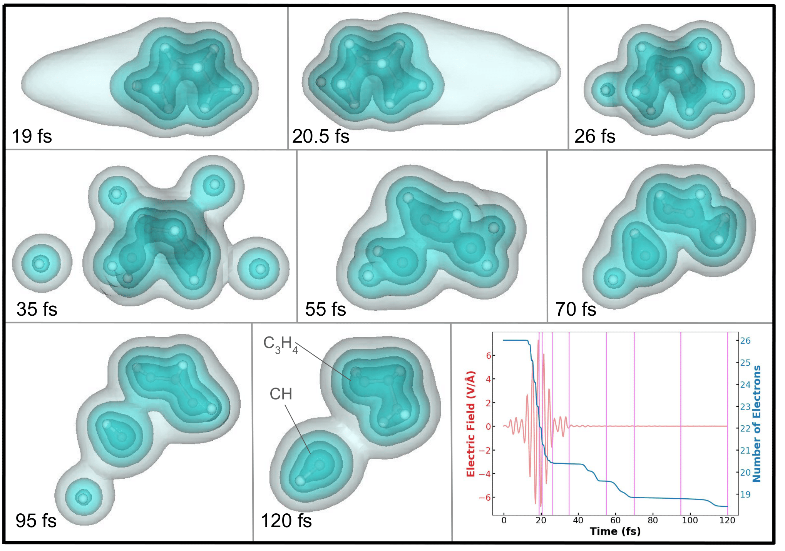
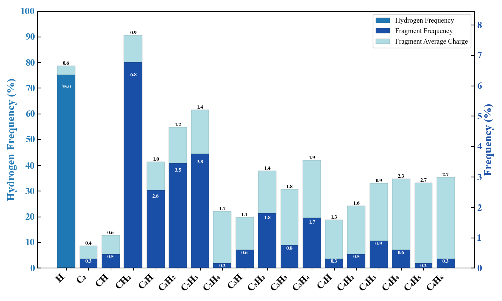

# TDDFT-output-and-scripts

**Description:** Data, output files, figures, and Python visualization scripts used for computational nanoscience research with Varga group.

        See below for information on each folder and what output/data/scripts is contained.

**_FIGURES:** Contains figures, diagrams, screenshots, and images that were generated using external software sources.

**cluster_job_run_script** Contains python scripts to automate running jobs on the cluster. Copies directories and renames the files accordingly, then submits each job ("qsub job.pbs")

**ELI_pulse_data_and_scale:** Contains all of the laser pulse data on pulses used in ELI-ALPS Coulomb explosion experiments AND scripts to scale the laser electric fields and visualize the pulse.

**excel_laser_generation:** Excel sheet provided by Cody Covington. Used to generate laser pulses given different parameters.

**histograms_stats_molecule_formation:** Contains statistical data on fragment formation Coulomb Explosion in hydrocarbons AND scripts to generate these figures.

**newton_plot:** Contains figures of newton plots (velocity v.s. velocity) AND scripts to generate them.

**proton_grid_projectile:** Contains a script to copy ground state directories and adjust the locations of the proton projectile to be placed in a grid. for being launched at a molecule

**pulse_electron_graph:** Contains data, figures, and animations on the pulse and the number of electrons in the grid AND scripts to generate line graphs of the pulse E-field and number of electrons v.s. time.

**pulse_vector_animation:** Contains animation of the electric field vector of a given pulse AND scripts to create this animation.

**seeds_random_extender:** Contains files of seeds for TDDFT Boltzmann distribution based runs AND scripts to generate/extend these seed files.

**trajectory_screenshots_mogli:** Contains generate screenshots of the a molecule at its last frame in the trajectory.xyz using mogli (https://github.com/sciapp/mogli).

**Acknowledgements:** Kalman Varga, Cody Covington
